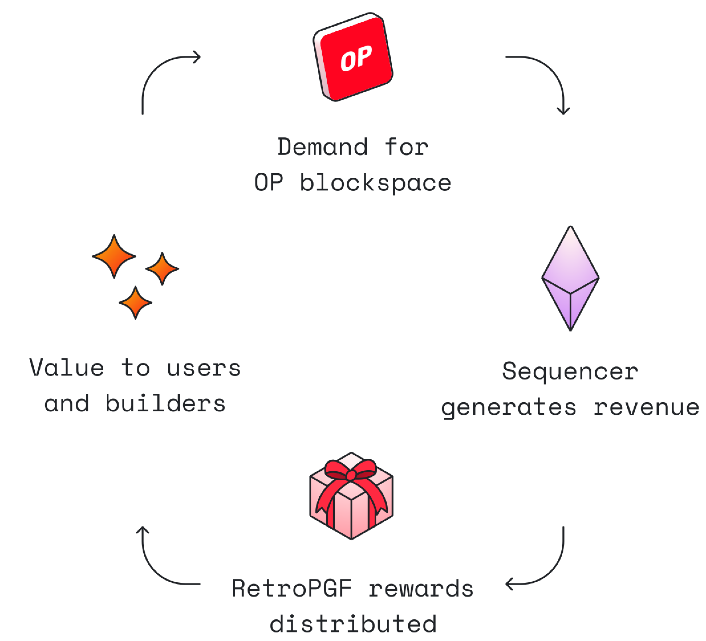

# Get Inspired with Builder Ideas!

Welcome to the Optimism Collective Builder Ideas!

Knowing where to start building can be overwhelming. Don’t worry though, we have you covered! Here you'll find various ideas that are intended to be a guiding light 💡as you start contributing to the Collective; from developer tooling to protocol experiments, and much more! These ideas have no guaranteed rewards, however by building them you may have a positive impact you can use to apply for Reto Funding. Builder ideas are here to provide guidance on what you could build for the Optimism Collective 💖

Choose an idea from the list, build it, create impact, and you might get rewarded via Retro Funding for your impact!

If you are looking for a grant, [you can find available grants](https://community.optimism.io/docs/governance/get-a-grant/) here.

## Retro Funding 101

Retroactive Public Goods Funding (Retro Funding) is how you get rewarded for your impact to the Collective! The more impact you create onchain, the more you might expect to be rewarded! Retro Funding has already rewarded over 600 builders with more than 40 million OP.

Retro Funding is guided by a simple framework - we believe it's easier to assess what has been useful in the past, than what might be useful in the future. Currently, the Collective runs Retro Funding rounds a couple times a year where projects that create the most impact are eligible for rewards. For more info see the [Retro Funding blog post](https://optimism.mirror.xyz/nz5II2tucf3k8tJ76O6HWwvidLB6TLQXszmMnlnhxWU)!

<!--- -->

Together, Impact = Profit & Retro Funding create a flywheel where impact in the Collective is rewarded sustainably! 

We have exciting rounds coming up!
* The Onchain Builders round will reward onchain builders for driving the adoption of Optimism
* The OP Stack round will reward contributions to the OP stack
* The Governance round will reward contributions which improve the capture resistance and resource allocation of Optimism Governance
* The Dev Tooling round will reward impact of developer tooling in supporting Optimism

Only one question remains - how do you get started and begin building impact for the Collective? The goal of the Ideas List is to answer this question!

## How does the Builder List work?

The Builder List is composed of many ideas for projects! You can find relevant ideas by searching within specific project categories, difficulty, verticals or skill sets!

To get started, merely get inspired by an idea and start building impact!

It’s important to remember that this list solely represents ideas, or projects to get started with Retro Funding! The goal is for you to get inspired and start building impact. Rewards are not guaranteed for anything built via an idea from the Ideas List.

### Looking for Proactive Grant Funding?

Ideas List projects are possible starting points for RetroPGF rounds, but if you’re looking for proactive grant funding, you can visit the Ecosystem Contributions page to view specific grants, which we call [Foundation Missions](https://github.com/ethereum-optimism/ecosystem-contributions/labels/Foundation%20Mission%20Request)! You can learn more about Missions by starting here.

As always, the Optimism Collective is a band of companies, communities, and citizens working together to build a sustainable future for Ethereum by rewarding impact! The Collective is motivated by a simple equation of Impact = Profit, where each builder is rewarded in proportion to the positive impact they create for the Collective. Get inspired by an idea and start building impact now!

## Claiming an idea:

To claim an idea follow the guide [here](./docs/claim-an-idea.md).

## Support and Additional Resources

We want to do everything we can to help you be successful while working on your contribution. Here you'll find various resources and communities that may help you complete a project. Please also feel free to ask for support directly in the [Optimism Developer Support GitHub](https://github.com/ethereum-optimism/developers).

### Communities

- [Optimism Discord](https://discord.gg/optimism)
- [Optimism Governance Forum](https://gov.optimism.io)

### Reference Material

- [Optimism Documentation](https://docs.optimism.io)
- [Optimism Help Center](https://help.optimism.io)

## ❓ Frequently Asked Questions (FAQ)

### General Questions

**Q: What is Retro Funding?**
A: Retro Funding is a mechanism that rewards projects based on their proven impact, rather than promising future results.

**Q: How much can I receive?**
A: Rewards vary by round and impact. Previous rounds have distributed millions of OP tokens to hundreds of projects.

**Q: Do I need to be a developer?**
A: No! Many valuable contributions come from designers, writers, community managers, and other roles.

### Application Process

**Q: When is the next round?**
A: Retro Funding rounds are announced on the [Optimism blog](https://optimism.mirror.xyz) and Discord.

**Q: How long does the process take?**
A: Typically 8-12 weeks from application to reward distribution.

**Q: Can I apply for multiple projects?**
A: Yes, but each project is evaluated independently.

### Technical Questions

**Q: What technologies should I use?**
A: Use whatever tools best solve the problem. Optimism is technology-agnostic.

**Q: Do I need to deploy on Optimism?**
A: Not necessarily. Many valuable contributions are off-chain tools, documentation, or community work.

**Q: Where can I get help?**
A: Join the [Optimism Discord](https://discord.optimism.io) or check the [Developer Support GitHub](https://github.com/ethereum-optimism/developers).

